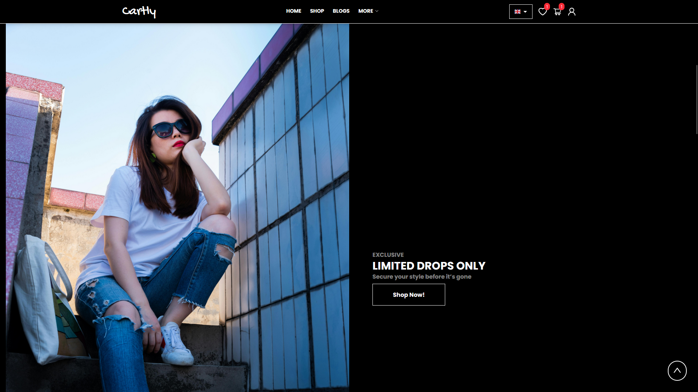
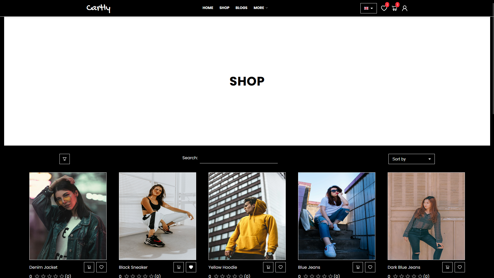
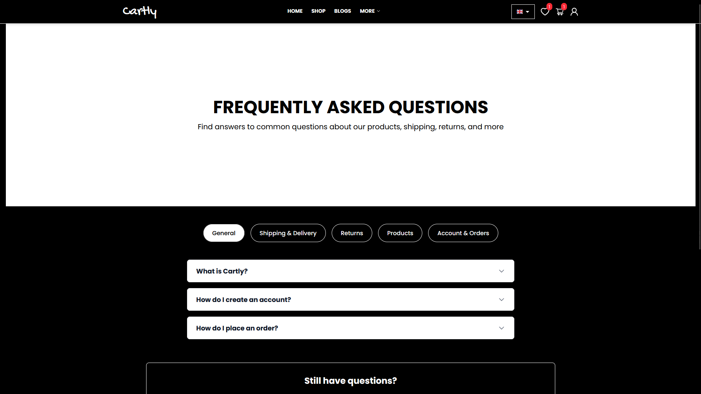

# 🛒 E-Commerce App (Cartly)

🔗 [Live Demo](https://e-commerce-cartly.vercel.app/)

A modern and responsive e-commerce web application built with React, TypeScript, Tailwind CSS and Firebase.

## 📦 Features

- ✅ Product listing with filters and sort options
- 🛍️ Shopping cart and wishlist
- 🔒 User authentication (sign in / sign up)
- 🌍 Multi-language support (i18n)
- 🌗 Light & dark mode
- 🧠 TanStack Query for data fetching & caching
- 🖼️ Responsive and mobile-friendly UI
- 📄 FAQ, About & Contact pages

## 📸 Screenshots

### 🏠 Home Page

### 🛒 Product List

### 👤 FAQ

### 🔐 Sign in

### 🔐 Blogs

## 🛠️ Tech Stack

| Category          | Libraries / Tools                          |
|------------------|---------------------------------------------|
| Frontend         | React, TypeScript                          |
| State / Data     | TanStack Query/ React Query                |
| Forms            | react-hook-form, zod                       |
| UI Framework     | Tailwind CSS, Material UI                  |
| Date Handling    | dayjs                                      |
| Icons            | react-icons, @ant-design/icons             |
| i18n             | react-i18next                              |
| Toasts / Alerts  | react-toastify                             |
| Backend          | Firebase                                    |

## 📬 Contact

For feedback or questions, feel free to reach out:

- GitHub: [@sahibrzazade](https://github.com/sahibrzazade)
- Email: sahibrzazade03@gmail.com
